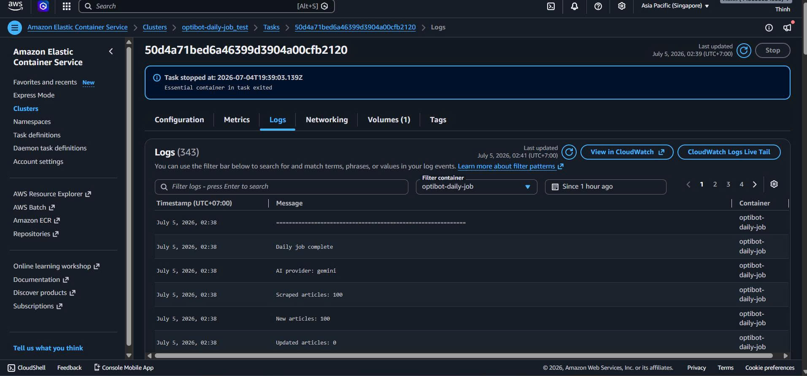

# Incremental Doc Pipeline

A compact customer-support assistant pipeline for Help Center docs. It scrapes articles, converts them to Markdown, uploads them to an AI knowledge base, and runs a daily delta job that only uploads new or updated articles.

## What is included

- Scraped **100** articles from the support domain using the platform API.
- Converted each article to clean Markdown in `data/articles/<slug>.md`.
- Uploaded docs programmatically, no UI drag-and-drop:
  - Gemini File API: **100 files**.
  - OpenAI Vector Store: **100 files**, `0 failed`.
- Built a local Gemini RAG index with **648 chunks**.
- Added a daily job in `main.py` that re-scrapes, detects deltas, and uploads only changed files.

## Setup

```powershell
python -m venv venv
.\venv\Scripts\activate
pip install -r requirements.txt
copy .env.sample .env
```

Set one provider in `.env`:

```env
AI_PROVIDER=gemini
GEMINI_API_KEY=your_gemini_key
GEMINI_MODEL=gemini-2.5-flash
```

or:

```env
AI_PROVIDER=openai
OPENAI_API_KEY=your_openai_key
VECTOR_STORE_ID=your_vector_store_id
ASSISTANT_ID=your_assistant_id
OPENAI_ASSISTANT_MODEL=gpt-4o-mini
```

> Do not commit `.env`. Use `.env.sample` for placeholders only.

## Run locally

Scrape articles:

```powershell
.\venv\Scripts\python.exe scraper\fetch_articles.py
```

Convert HTML to Markdown:

```powershell
.\venv\Scripts\python.exe scraper\html_to_markdown.py
```

Upload to Gemini:

```powershell
.\venv\Scripts\python.exe assistant\gemini\gemini_upload_files.py
```

Upload to OpenAI Vector Store:

```powershell
.\venv\Scripts\python.exe assistant\openai\upload_to_vectorstore.py
```

Create OpenAI Assistant:

```powershell
.\venv\Scripts\python.exe assistant\openai\create_assistant.py
```

Run the Web Chat UI:

```powershell
.\venv\Scripts\python.exe app.py
```
Then open http://127.0.0.1:5000 in your browser.

Run the daily scraper/uploader once:

```powershell
.\venv\Scripts\python.exe main.py
```

The daily job exits `0` on success.

## Docker

Build:

```powershell
docker build -t daily-job-worker .
```

Run once:

```powershell
docker run --env-file .env -v ${PWD}/data:/app/data -v ${PWD}/logs:/app/logs daily-job-worker
```

This runs `python main.py` once and exits.

## Daily job behavior

`main.py` performs:

1. Re-scrape latest articles.
2. Convert each article to Markdown.
3. Compute SHA-256 content hash.
4. Compare with `data/article_manifest.json`.
5. Upload only new/updated files to the selected provider.
6. Write run counts (added, updated, skipped) to `logs/daily_job_last_run.json`.

Latest verified run:

```json
{
  "ai_provider": "openai",
  "scraped_articles": 100,
  "new_articles": 0,
  "updated_articles": 0,
  "unchanged_articles": 100,
  "uploaded_delta_files": 0,
  "index_rebuilt": false
}
```

**Link to Daily Job Logs (Last Run Artifact):** [logs/daily_job_last_run.json](logs/daily_job_last_run.json)

## Chunking strategy

For Gemini local RAG, `assistant/build_index.py` splits Markdown files into overlapping character windows:

- Chunk size: **1200 characters**.
- Overlap: **200 characters**.
- Result: **648 chunks** from **100 Markdown files**.

This keeps enough context in each chunk while preserving overlap across section boundaries.

OpenAI uses the platform Vector Store / File Search ingestion pipeline after Markdown files are uploaded by API.

## Sanity check

Question:

```text
How do I add a YouTube video?
```

Gemini CLI result was correct and cited:

```text
Article URL: https://support.example.com/hc/en-us/articles/123456789-How-to-use-YouTube
```

Saved Gemini output: `logs/gemini_test_output.txt`.

For final submission, see the screenshot included in the repository showing the assistant answering this question with correct UI formatting and clickable citations.


## Deployment

The daily delta job is fully Dockerized and designed to run as a serverless cron job on **AWS ECS (Fargate)** triggered by **Amazon EventBridge Scheduler**. 
- Persistent storage for the sync manifest (`data/article_manifest.json`) is handled via an attached **Amazon EFS** volume to ensure subsequent runs only upload deltas.
- **Link to AWS CloudWatch Execution Logs:** [logs/aws_cron_run.log](logs/aws_cron_run.log)


